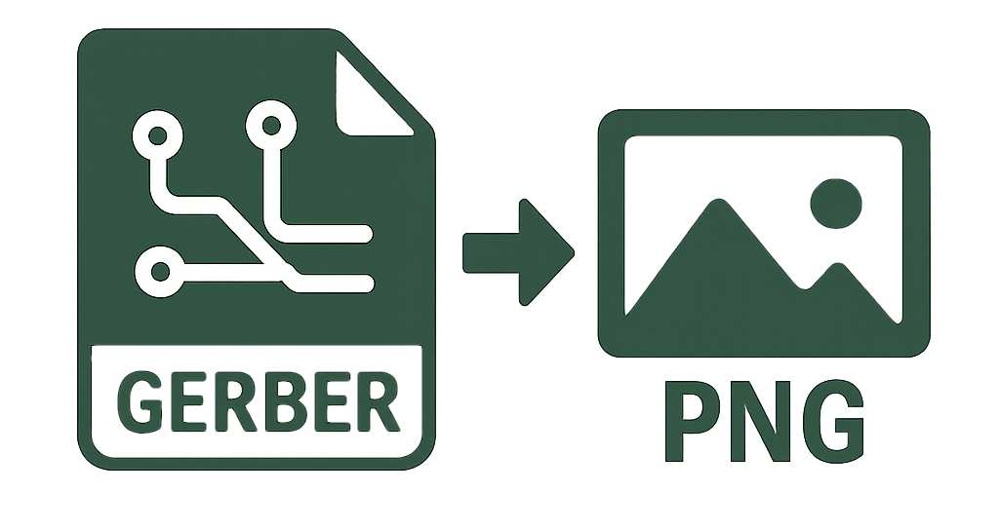

# Gerber to PNG Converter [](https://github.com/spoterianski/gerber2png-service/actions) [](LICENSE) [](https://www.python.org/downloads/) [](https://nodejs.org/) [](https://github.com/spoterianski/gerber2png-service/actions) [](https://github.com/psf/black) [](https://www.typescriptlang.org/)



You can try it on[https://g2p.m0n.dev](https://g2p.m0n.dev)

Web service for converting Gerber and Drill files exported from KiCad into PNG images for subsequent PCB exposure using a photopolymer printer.

## 🚀 Features

- Convert Gerber and Drill files to PNG
- Support for various photopolymer printers
- Horizontal and vertical image flipping

## 🛠 Technologies

- **Frontend**: React, TypeScript, Tailwind CSS
- **Backend**: Python, FastAPI, Uvicorn
- **Conversion**: Gerber2PNG
- **Containerization**: Docker, Docker Compose

## 📋 Requirements

- Docker
- Docker Compose
- Git

## 🚀 Quick Start

1. Clone the repository:
```bash
git clone https://github.com/spoterianski/gerber2png-service.git
cd gerber2png-service
```

2. Create `.env` file in the root directory:
```env
# Backend settings
PYTHONUNBUFFERED=1

# Frontend settings
REACT_APP_API_URL=http://localhost:8000

# Docker settings
COMPOSE_PROJECT_NAME=gerber2png-online
```

3. Start the application:
```bash
docker-compose up -d
```

4. Open in your browser:
- Frontend: http://localhost:3000
- Backend API: http://localhost:8000

## 📝 Usage

1. Export your PCB layout from KiCad in Gerber and Drill formats
2. Open the web interface
3. Select your printer from the list
4. Upload Gerber and Drill files
5. Enable horizontal/vertical flipping if needed
6. Click "Convert" and download the resulting PNG image

## 🔧 Development

### Running in Development Mode

```bash
# Backend
cd backend
pip install -r requirements.txt
uvicorn src.app.main:app --reload

# Frontend
cd frontend
npm install
npm start
```

### Running Tests

```bash
# Backend
cd backend
pytest tests/ -v --cov=src --cov-report=term-missing

# Frontend
cd frontend
npm test
```

## 📄 License

MIT License - see [LICENSE](LICENSE) file for details

## 👥 Author

- **Sergey Poterianski** - [spoterianski](https://github.com/spoterianski)

## 🙏 Acknowledgments

- [KiCad](https://www.kicad.org/) - for the excellent electronics design tool
- [UVTools](https://github.com/sn4k3/UVtools) - for the photopolymer printer utility 